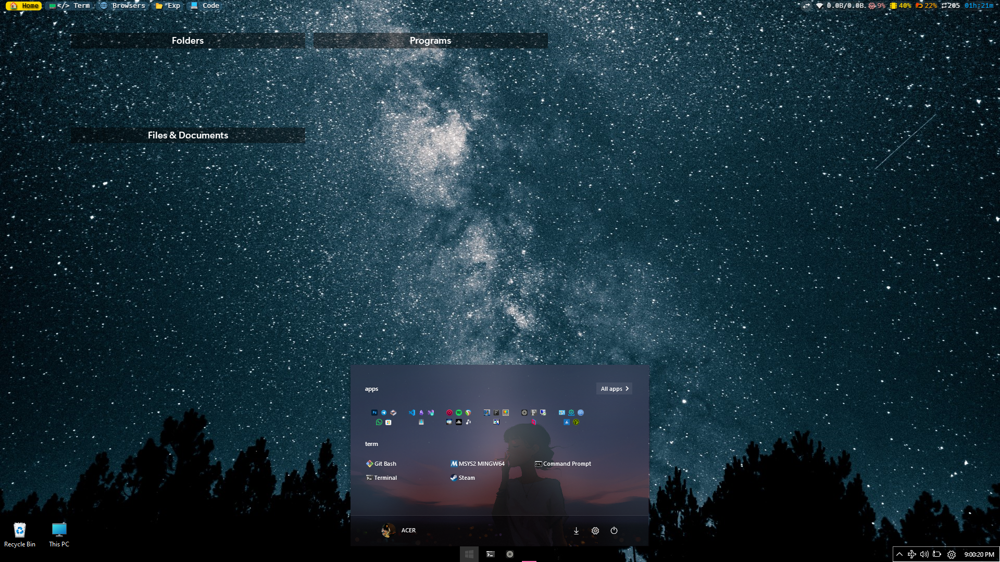
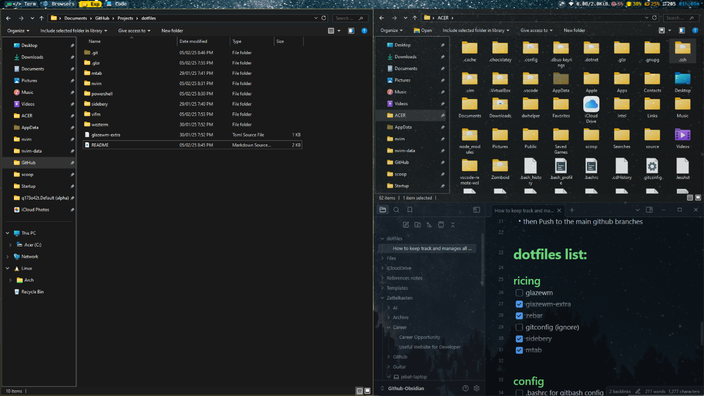
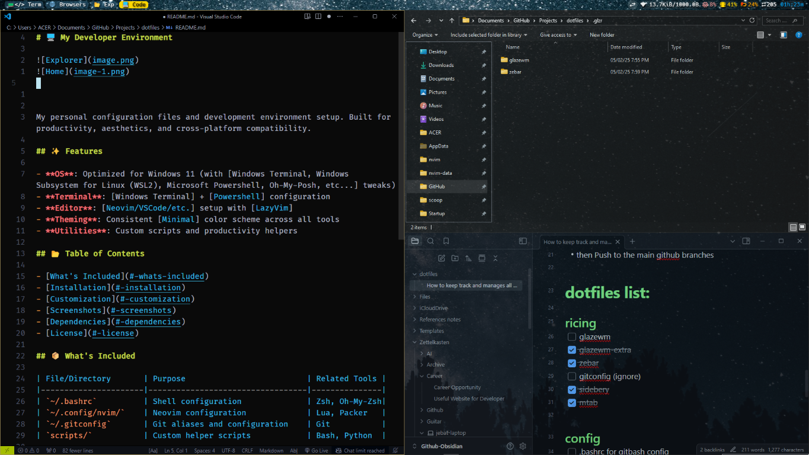

# 🖥️ My Developer Environment

My personal configuration files and development environment setup. Built for productivity, aesthetics, and cross-platform compatibility.

## ✨ Features

- **OS**: Optimized for Windows 11 (with [Windows Terminal, Windows Subsystem for Linux (WSL2), Microsoft Powershell, Oh-My-Posh, etc...] tweaks)
- **Terminal**: [Windows Terminal] + [Powershell] configuration
- **Editor**: [Neovim/VSCode/etc.] setup with [LazyVim]
- **Theming**: Consistent [Minimal] color scheme across all tools
- **Utilities**: Custom scripts and productivity helpers

## 📂 Table of Contents

- [What's Included](#-whats-included)
- [Customization](#-customization)
- [Installations](#-Installations)

## 📦 What's Included

| File/Directory                | Purpose                                                | Related Tools                |
| ----------------------------- | ------------------------------------------------------ | ---------------------------- |
| `~/.bashrc`                   | Shell configuration                                    | Bash, Oh-My-Posh             |
| `~/appdata/local//nvim`       | Neovim configuration                                   | LazyVim                      |
| ~~`~/.gitconfig`~~            | ~~Git aliases and configuration~~                      | ~~Git~~                      |
| `~/windows terminal`          | Windows Terminal                                       | Powershell, Windows Terminal |
| `~/mtab`                      | Customize new tab                                      | Zen Browser                  |
| `~/.glzr/glazewm`             | Tiling window manager                                  | GlazeWM                      |
| `~/.glzr/zebar`               | Top/bottom bar                                         | Zebar                        |
| `~/glazewm-extra.toml`        | Add transparency, remove titlebar                      | GlazeWM                      |
| `~/powershell`                | Powershell aliases, profile, oh-my-posh, icons, etc... | Powershell 7+                |
| `~/sidebery`                  | Tree-style tab                                         | Zen Browser                  |
| `~/vifm`                      | Neovim inspired file manager                           | Vifm                         |
| `~/appdata/roaming/code/user` | VSCode customization                                   | Visual Studio Code,          |
| `~/appdata/local/lazygit`     |                                                        |                              |
| `~/documents/fxsound/presets` | FxSound EQ Presets                                     | FxSound                      |
|                               |                                                        |                              |
|                               |                                                        |                              |

### Extra paid/closed source software
- Start11 from Stardock
- Fences from Stardock
- Cider (preview) for Apple Music client on Windows
- 
p.s you can easily get these files/installer for free if you ask me. (except for cider)
## 🛠️ Installations

- https://gitforwindows.org/
- https://github.com/PowerShell/PowerShell
- 
