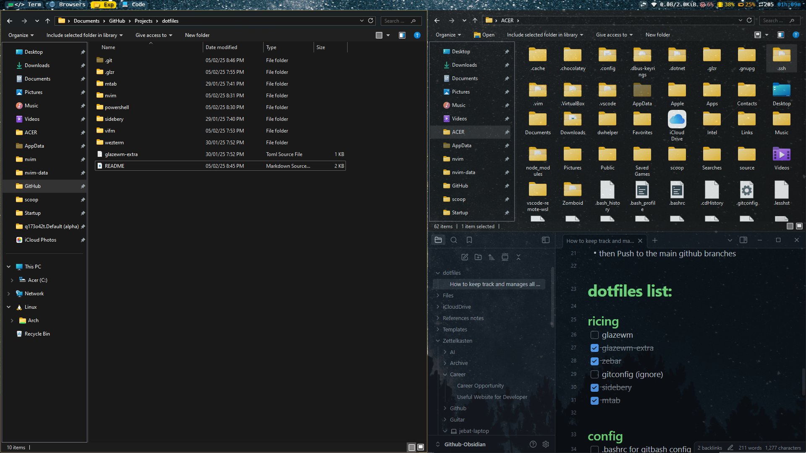

# 🖥️ My Developer Environment


 *← Add your own screenshot*

My personal configuration files and development environment setup. Built for productivity, aesthetics, and cross-platform compatibility.

## ✨ Features

- **OS**: Optimized for [Your OS] (with [OS-specific] tweaks)
- **Terminal**: [Terminal name] + [Shell name] configuration
- **Editor**: [Neovim/VSCode/etc.] setup with [specific features]
- **Theming**: Consistent [theme name] color scheme across all tools
- **Utilities**: Custom scripts and productivity helpers

## 📂 Table of Contents

- [What's Included](#-whats-included)
- [Installation](#-installation)
- [Customization](#-customization)
- [Screenshots](#-screenshots)
- [Dependencies](#-dependencies)
- [License](#-license)

## 📦 What's Included

| File/Directory       | Purpose                          | Related Tools |
|----------------------|----------------------------------|---------------|
| `~/.zshrc`           | Shell configuration              | Zsh, Oh-My-Zsh|
| `~/.config/nvim/`    | Neovim configuration             | Lua, Packer   |
| `~/.tmux.conf`       | Terminal multiplexer setup       | Tmux          |
| `~/.gitconfig`       | Git aliases and configuration    | Git           |
| `scripts/`           | Custom helper scripts            | Bash, Python  |

## 🚀 Installation

### Quick Install (Bash)
```bash
curl -sL https://raw.githubusercontent.com/yourusername/dotfiles/main/install.sh | bash
Note: Always review scripts before executing!
Manual Installation

    Clone repo:
    bash
    Copy

    git clone https://github.com/yourusername/dotfiles.git ~/.dotfiles

    Use GNU Stow to symlink configurations:
    bash
    Copy

    cd ~/.dotfiles
    stow nvim zsh tmux git  # List your configurations here

🎨 Customization
Theme Switching

To change color schemes:
bash
Copy

# List available themes
dotfiles-theme list

# Apply theme
dotfiles-theme apply nord

Key Bindings

Custom keyboard shortcuts are defined in:
Copy

~/.config/keybindings.conf

📷 Screenshots
Component	Preview
Terminal	Terminal
Editor	Editor
Desktop	Desktop
📦 Dependencies
Core Requirements

    Font: [Fira Code Nerd Font]

    Zsh + [Oh-My-Zsh]

    Neovim (≥ 0.9)

Plugin Managers

    Packer.nvim (Neovim)

    Tmux Plugin Manager

    Zsh Plugins (through antigen/zplug)

❓ FAQ

Q: How do I update my configurations?
bash
Copy

cd ~/.dotfiles && git pull && stow --restow

Q: Conflict with existing configs?
Backup first:
bash
Copy

mv ~/.zshrc ~/.zshrc.bak

📜 License

MIT License - See LICENSE for details.

Maintenance
PRs Welcome
License
