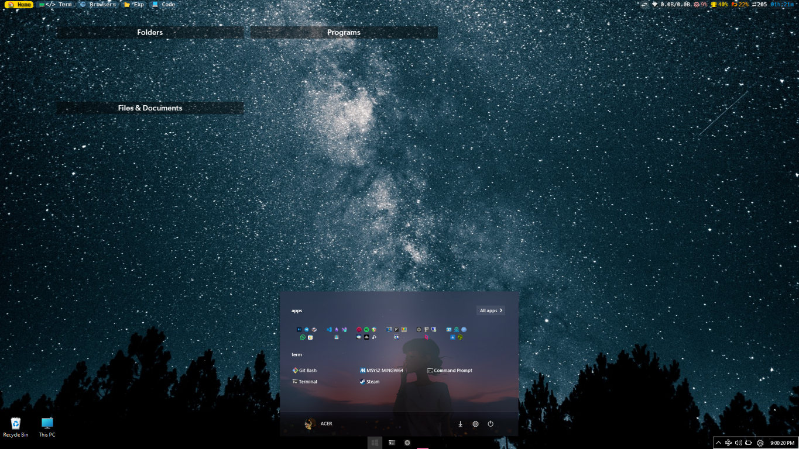

# 🖥️ My Developer Environment

My personal configuration files and development environment setup. Built for productivity, aesthetics, and cross-platform compatibility.

## ✨ Features

- **OS**: Optimized for Windows 11 (with [Windows Terminal, Windows Subsystem for Linux (WSL2), Microsoft Powershell, Oh-My-Posh, etc...] tweaks)
- **Terminal**: [Windows Terminal] + [Powershell] configuration
- **Editor**: [Neovim/VSCode/etc.] setup with [LazyVim]
- **Theming**: Consistent [Minimal] color scheme across all tools
- **Utilities**: Custom scripts and productivity helpers

## 📂 Table of Contents

- [What's Included](#-whats-included)
- [Customization](#-customization)
- [Screenshots](#-screenshots)
- [Dependencies](#-dependencies)
- [License](#-license)

## 📦 What's Included

| File/Directory       | Purpose                          | Related Tools   |
|----------------------|----------------------------------|-----------------|
| `~/.bashrc`          | Shell configuration              | Bash, Oh-My-Posh|
| `~/.config/nvim/`    | Neovim configuration             | Lua, Packer     |
| `~/.gitconfig`       | Git aliases and configuration    | Git             |
| `scripts/`           | Custom helper scripts            | Bash, Python    |
